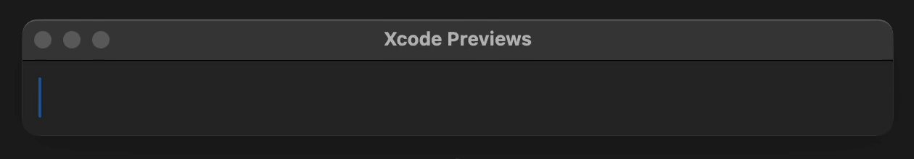

# Autocomplete

Autocomplete is a Swift package to autocomplete text fields.

It was built for [Attune], and should not be considered a robust general solution.

[Attune]: https://github.com/keiranking/Attune



## Requirements

macOS 14+
iOS 16+

## Install

Add `https://github.com/keiranking/Autocomplete` in the [Swift Package Manager in Xcode](https://developer.apple.com/documentation/xcode/adding_package_dependencies_to_your_app).

## Usage

```swift
import Autocomplete

TextField("", text: $text)
    .autocomplete(
        text: $text,
        using: ["apples", "bananas", "cherries"]
    )
```

## License

This project is licensed under [CC BY-NC 4.0](https://creativecommons.org/licenses/by-nc/4.0/).

You may view, modify, and redistribute the source for non-commercial
purposes only. Commercial use is not permitted without prior permission.

See the [LICENSE](LICENSE.txt) file for details.
